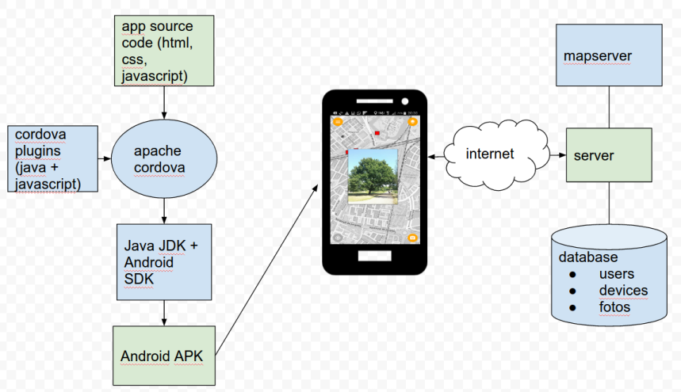

# Phenlogy App
Android app and corresponding server to track and view the changing appearance, _phenology_, of vegetation, trees in particular. Take a picture of a tree, later return to the picture location using the built in map, take a new picture of the same tree overlaid on top of the previous picture and view the resulting animation.

Install app:
-------
>download and install [the apk](https://phenology.geodan.nl/phenology/apk/android-debug5.apk) to your android device

Build app from source
-------
#### Prerequisites
* Apache Cordova (requires Android SDK wich requires Java SDK)
* git
* bower

```
git clone this_repository.git
cd photoapp/www/ol3
bower install
cd ../..
cordova platform add android
cordova plugin add `cat cordovaplugins.txt`
# update www/ol3/config.js for your configuration
cordova build
```


Install server
-------
#### Prerequisites
* postgres database (version 9.5)
* postgis extension
* nodejs
* http and https reverse proxy server (haproxy, nginx, apache httpd)

create a postgres database 'locophoto', user 'geodb', password 'yourpassword'


```
git clone this_repository.git
cd photoapp/node

#create database tables
psql -h localhost -U geodb -W locophoto < database.sql

#start the server
node photoserver.js
```


Overview
------

